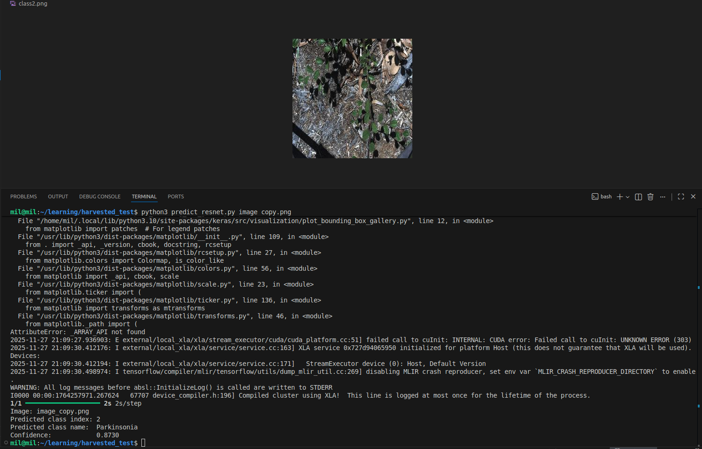

# Weed Detection and Classification Project

## Project Story and Implementation Plan

The goal of this project is to build a weed detection system for agricultural fields using computer vision. The approach is divided into three main stages:

### 1. Weed Classification  
The first step is to classify weed species from field images, which is simpler and a great starting point. The project begins with a baseline ResNet-50 model to classify different weed species. ResNet-50 serves as a strong baseline and performs well on image classification tasks, surpassing many ImageNet benchmarks.[web:183][web:187]

### 2. Model Enhancement and Comparison  
After establishing the baseline with ResNet-50, an enhanced version of the network with attention mechanisms (ResNet-50 + Attention) is developed. By comparing accuracy, precision, recall, mAP, IoU, and other metrics of these two architectures, the project identifies which model is better suited for robust weed classification in real-world conditions.

### 3. Segmentation and Crop–Weed Differentiation (Planned)  
The next stage, still in planning, involves segmenting crop vs. weed areas in the field images. Segmentation architectures such as U-Net or Mask R-CNN will be explored. This phase will enable precise localization of weeds and crops for targeted interventions.

## Methodology Overview

- Use the DeepWeeds dataset (17,509 images, 9 classes) for training and validation.[web:180][web:183]
- Train a baseline classification model using ResNet-50.
- Implement and compare a ResNet-50 + Attention model.
- Evaluate using mAP, IoU, Precision, Recall, F1-score, confusion matrices, and failure-case analysis.
- Analyze robustness under varying camera and lighting conditions.
- For segmentation, experiment with architectures such as U-Net or Mask R-CNN once classification is optimized.
- Use the insights from classification and robustness studies to guide sensor and deployment recommendations.

## Model Comparison

Direct comparison of baseline ResNet-50 vs. ResNet-50 + Attention on DeepWeeds test set (1,752 images):

| Metric | ResNet-50 Baseline | ResNet-50 + Attention | Improvement |
|--------|-------------------|----------------------|-------------|
| **Training Epochs** | 77 | 55 | **-22 epochs** |
| **Test Accuracy** | 77.0% | 81.0% | **+4.0%** |
| **Macro Precision** | 71.9% | 74.1% | **+2.2%** |
| **Macro Recall** | 78.7% | 85.3% | **+6.6%** |
| **Macro F1-Score** | 73.1% | 78.4% | **+5.3%** |
| **Weighted F1** | 78.0% | 82.0% | **+4.0%** |
| **mAP** | 85.5% | 89.0% | **+3.5%** |
| **Mean IoU** | 58.5% | 65.2% | **+6.7%** |

**Key Takeaways**:
- Attention mechanism provides consistent improvements across all metrics.
- **Faster convergence**: attention model reaches superior performance in 55 epochs vs. 77 for baseline (**29% fewer epochs**).
- Largest gains in **macro recall** (+6.6%) and **mean IoU** (+6.7%), indicating better detection of minority weed classes.
- The enhanced model achieves **81% accuracy** with stronger generalization to underrepresented species.
- Recommended for deployment: **ResNet-50 + Attention** due to superior robustness, faster training, and balanced performance.
## Local Inference
  
This project includes a simple script to run inference on a single image using the trained model.

### Requirements

- Python 3.x
- TensorFlow / Keras installed
- Saved model file (e.g., `deepweeds_resnet.keras`)
- `predict.py` in the same directory as the model
### Usage

From the project directory, run:
```bash
python predict.py class2.png
```
Replace `class2.png` with the path to any input image you want to classify.

The script will print:

- Predicted class index  
- Predicted class name  
- Confidence score (probability)
## Detailed Model Reports

For detailed evaluation, metrics, visualizations, and robustness analysis of each model, see:

- **Baseline ResNet-50 classification report:**  
  [ResNet-50 Evaluation](Resnet_classification.md)

- **ResNet-50 + Attention classification report:**  
  [ResNet-50 + Attention Evaluation](resnet_attention_classification.md)


