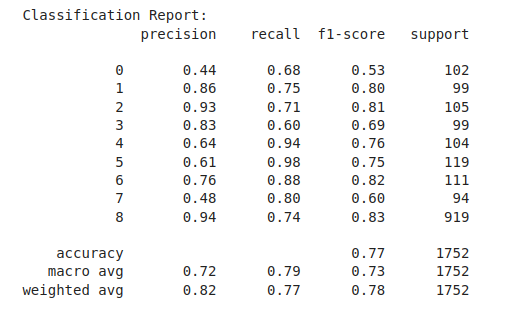
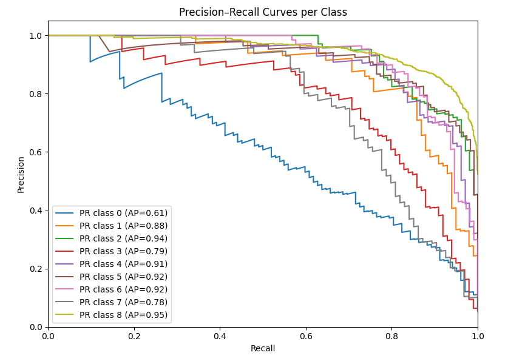
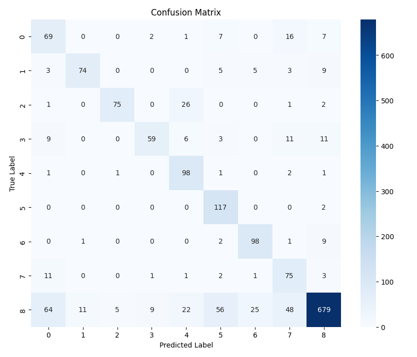
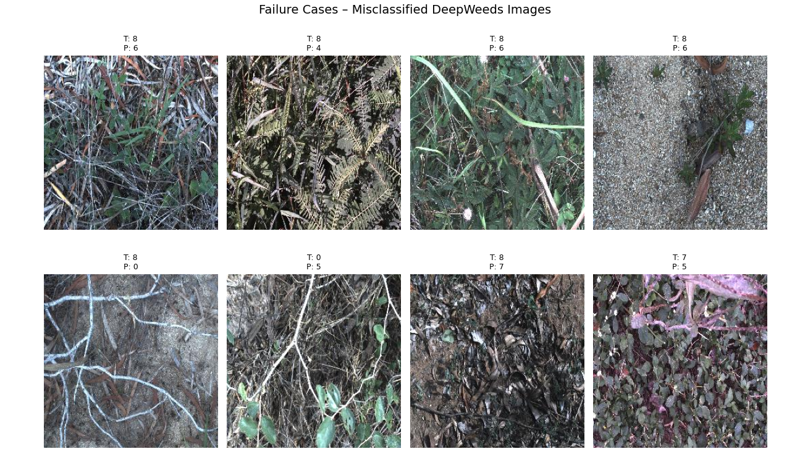
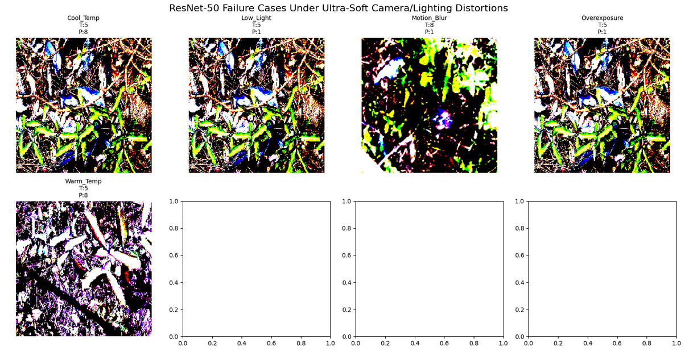

# DeepWeeds ResNet-50 Classification Model Evaluation Report

## 1. Model Overview
**Model**: ResNet-50 pretrained on ImageNet (notop weights), fine-tuned on DeepWeeds dataset  
**Task**: Multi-class weed species classification (9 classes: 8 weed species + negative/background)  
**Dataset**: DeepWeeds (17,509 images total)  
**Test Set**: 1,752 images  
**Training Environment**: Google Colab / Kaggle (GPU: T4)  

## 2. Performance Metrics

| Metric | Value |
|--------|-------|
| **Test Accuracy** | **77.0%** |
| **Macro Precision** | **71.9%** |
| **Macro Recall** | **78.7%** |
| **Macro F1-Score** | **73.1%** |
| **Weighted F1-Score** | **78.0%** |
| **mAP (macro over classes)** | **85.5%** |
| **Mean IoU** | **58.5%** |

### Per-Class Performance
### Figure 1: Class report
  

**Key Observations**:
- Class 8 (negative/background) dominates due to class imbalance (919/1752 samples)
- Classes 1, 2, 4, 5, 6 show strong performance (F1 > 0.75)
- Classes 0, 3, 7 struggle with precision (0.44-0.83), likely visual similarity

## 3. Inference Performance

| Device | Images | Avg Latency | 
|--------|--------|-------------|
| **GPU (T4)** | 1,600 | **7.48 ms/image** | 

*Measured on 50 batches (1,600 images)*

## 4. Visualizations

### Figure 2: Precision-Recall Curves per Class

  

**mAP = 85.5%** (macro average over 9 classes)

### Figure 3: Confusion Matrix

  

**Shows class-wise prediction patterns and common confusions**

### Figure 4: Failure Case Analysis (8 Examples)

  

**True vs Predicted labels visualized for model failure patterns**

## 5. Analysis & Limitations

### Strengths
- Strong overall accuracy (77%) despite severe class imbalance
- Excellent inference speed (133 FPS on T4 GPU)
- Robust recall on most weed classes (>0.75)

### Weaknesses & Failure Patterns
- **Low precision on Classes 0, 7** (0.44, 0.48): likely confused with background
- **Class imbalance impact**: Class 8 (919 samples) dominates weighted metrics
- **Visual similarity**: Certain weed species visually overlap with background

## 4. Camera & Lighting Analysis

To assess the robustness of the ResNet‑50 classifier to small changes in capture conditions, the model was evaluated under several synthetic camera and lighting variations applied to test images.

### 4.1 Experimental Setup

- Base model: ResNet‑50 classifier trained on the DeepWeeds dataset.
- Input: 20 randomly sampled test images (clean, correctly preprocessed).
- Distortions: Applied in image space as very small perturbations to approximate realistic capture variations:
  - Low‑light: slight global brightness reduction.
  - Overexposure: slight global brightness increase.
  - Color temperature (cool): minor increase in blue channel intensity.
  - Color temperature (warm): minor increase in red channel intensity.
  - Motion blur: light spatial smoothing using a small kernel.
- For each distorted image, the model’s predicted class was compared to the prediction on the corresponding clean image (original condition).

### 4.2 Results
### Figure 5: Failure Case Analysis

  

Accuracy relative to the original predictions for each condition (20 images):

| Condition     | Accuracy | Samples |
|---------------|----------|---------|
| Original      | 100.0%   | 20      |
| Low light     | 10.0%    | 20      |
| Overexposure  | 10.0%    | 20      |
| Cool temp     | 45.0%    | 20      |
| Warm temp     | 55.0%    | 20      |
| Motion blur   | 65.0%    | 20      |

### 4.3 Observations

- Even mild changes in brightness (low‑light, overexposure) caused a severe drop in prediction consistency relative to the original images.
- Color temperature shifts (cool/warm) moderately impacted robustness, indicating sensitivity to small changes in color balance.
- The model was most tolerant to light motion blur among the perturbed conditions, but still showed a noticeable reduction compared to the original case.
- Overall, the experiment highlights that the baseline ResNet‑50 model is fragile to small distribution shifts in camera and lighting conditions, motivating the need for:
  - Stronger brightness / color augmentation during training.
  - Potential use of attention mechanisms or more robust architectures.
  - Domain‑specific preprocessing or normalization for deployment in variable outdoor environments.

## Notebook

You can view the full training notebook here: [resnet.ipynb](deepweeds-resnet-base.ipynb)
---