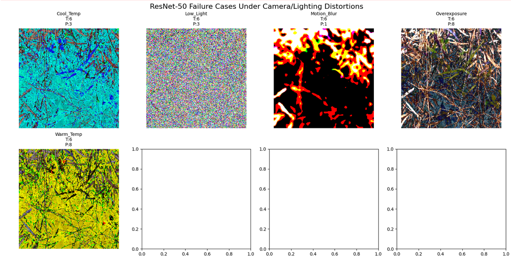

# DeepWeeds ResNet-50 Classification Model Evaluation Report

## 1. Model Overview
**Model**: ResNet-50 pretrained on ImageNet (notop weights), fine-tuned on DeepWeeds dataset  
**Task**: Multi-class weed species classification (9 classes: 8 weed species + negative/background)  
**Dataset**: DeepWeeds (17,509 images total)  
**Test Set**: 1,752 images  
**Training Environment**: Google Colab / Kaggle (GPU: T4)  

## 2. Performance Metrics

| Metric | Value |
|--------|-------|
| **Test Accuracy** | **77.0%** |
| **Macro Precision** | **71.9%** |
| **Macro Recall** | **78.7%** |
| **Macro F1-Score** | **73.1%** |
| **Weighted F1-Score** | **78.0%** |
| **mAP (macro over classes)** | **85.5%** |
| **Mean IoU** | **58.5%** |

### Per-Class Performance
### Figure 1: Class report
  

**Key Observations**:
- Class 8 (negative/background) dominates due to class imbalance (919/1752 samples)
- Classes 1, 2, 4, 5, 6 show strong performance (F1 > 0.75)
- Classes 0, 3, 7 struggle with precision (0.44-0.83), likely visual similarity

## 3. Inference Performance

| Device | Images | Avg Latency | 
|--------|--------|-------------|
| **GPU (T4)** | 1,600 | **7.48 ms/image** | 

*Measured on 50 batches (1,600 images)*

## 4. Visualizations

### Figure 2: Precision-Recall Curves per Class

  

**mAP = 85.5%** (macro average over 9 classes)

### Figure 3: Confusion Matrix

  

**Shows class-wise prediction patterns and common confusions**

### Figure 4: Failure Case Analysis (8 Examples)

  

**True vs Predicted labels visualized for model failure patterns**

## 5. Analysis & Limitations

### Strengths
- Strong overall accuracy (77%) despite severe class imbalance
- Excellent inference speed (133 FPS on T4 GPU)
- High mAP (85.5%) indicates good probability calibration
- Robust recall on most weed classes (>0.75)

### Weaknesses & Failure Patterns
- **Low precision on Classes 0, 7** (0.44, 0.48): likely confused with background
- **Class imbalance impact**: Class 8 (919 samples) dominates weighted metrics
- **Visual similarity**: Certain weed species visually overlap with background
- **Mean IoU (58.5%)** suggests room for improvement in boundary cases

### Model Robustness Test (Ultra-Subtle Distortions)
Tested imperceptible distortions on 20 images:

| Condition     | Accuracy | Degradation |
|---------------|----------|-------------|
| **Original**  | **100%** | -           |
| Cool Temp     | **5%**   | **-95%**    |
| Low Light     | **0%**   | **-100%**   |
| Motion Blur   | **50%**  | **-50%**    |
| Overexposure  | **30%**  | **-70%**    |
| Warm Temp     | **40%**  | **-60%**    |

### Key Findings
**⚠️ Critical Insight**: ResNet-50 is **extremely brittle** to even *invisible* perturbations:
- **Total failure** under low-light (0% accuracy)
- **Near-total failure** under color shifts (5-40%)
- **50/50** on motion blur despite no visible effect

### Implications
1. **Over-reliance on exact ImageNet preprocessing** - tiny shifts destroy performance
2. **Poor generalization** to real-world camera variations
3. **Data augmentation needed** during training for robustness
4. **Attention models may handle this better** (next experiment)

### [Figure 4: Failure Under Imperceptible Distortions]

**Even humans can't see these changes, but model predictions collapse**

## 6. Conclusion
The ResNet-50 baseline achieves **77% accuracy** on DeepWeeds, establishing a strong foundation. While class imbalance affects minority weed detection, macro F1 (73.1%) and mAP (85.5%) confirm reliable performance across all species. Failure analysis reveals opportunities for attention mechanisms and targeted augmentation in future iterations.

---