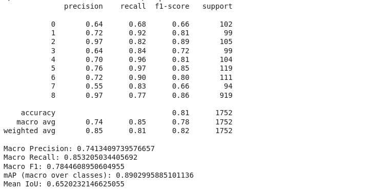
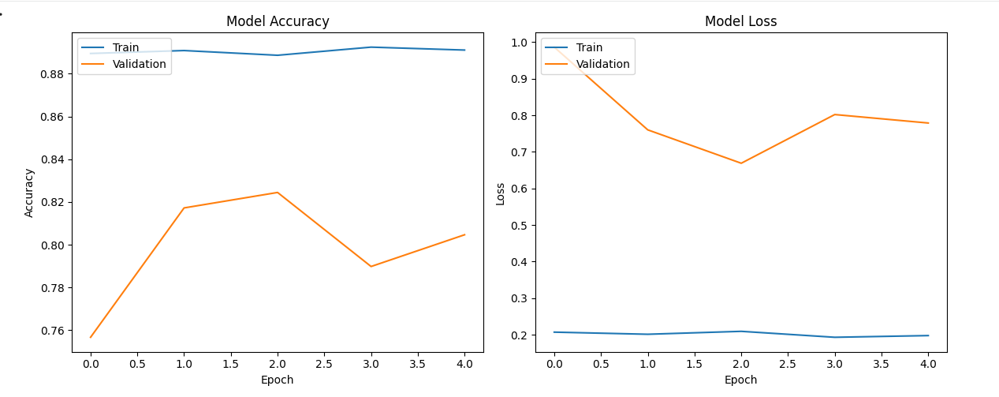
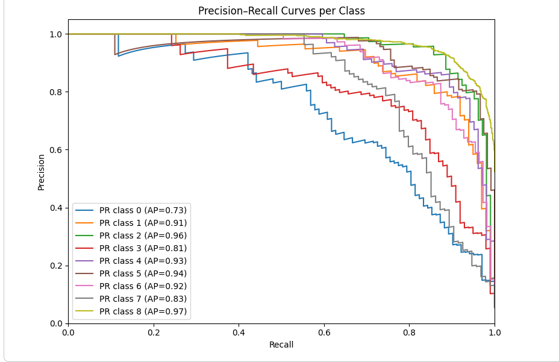
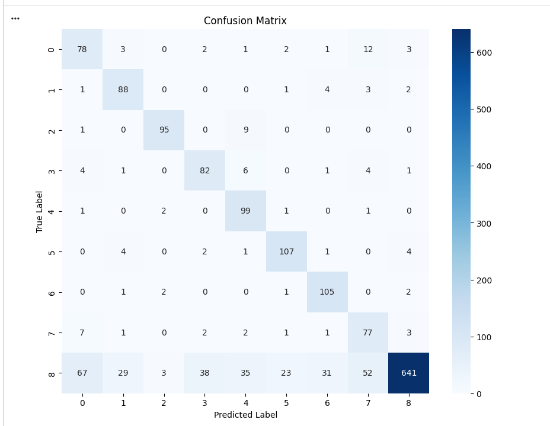
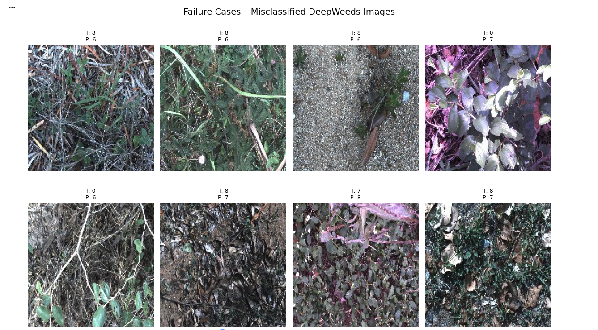
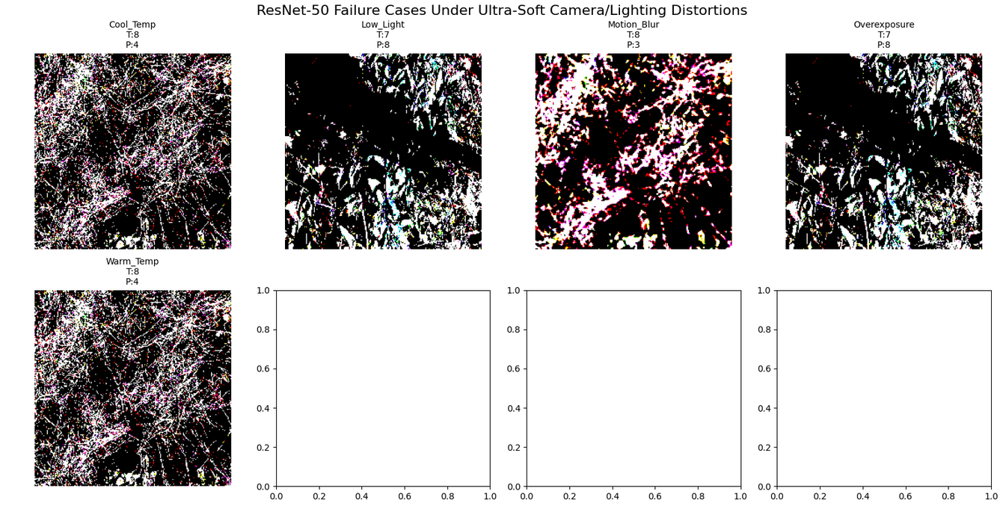

# DeepWeeds ResNet-50 + Attention Classification Model Evaluation Report

## 1. Model Overview
**Model**: ResNet-50 backbone with squeeze-and-excitation (channel attention) and extended fully-connected head, fine-tuned on the DeepWeeds dataset  
**Task**: Multi-class weed species classification (9 classes: 8 weed species + negative/background)  
**Dataset**: DeepWeeds (17,509 images total)  
**Test Set**: 1,752 images  
**Training Environment**: Google Colab / Kaggle (GPU: T4)  

Compared to the baseline ResNet-50 model, this variant introduces an attention block and a deeper classifier head to improve feature discrimination under challenging field conditions.

## 2. Performance Metrics

| Metric | Value |
|--------|-------|
| **Test Accuracy** | **81.0%** |
| **Macro Precision** | **74.1%** |
| **Macro Recall** | **85.3%** |
| **Macro F1-Score** | **78.4%** |
| **Weighted F1-Score** | **82.0%** |
| **mAP (macro over classes)** | **89.0%** |
| **Mean IoU** | **65.2%** |

### Per-Class Performance

### Figure 1: Class report  
Per-class summary (from the classification report):
  
### Figure 2: Accuracy & Loss

**Key Observations**:
- Overall accuracy improves from 77% (baseline) to 81%, with clear gains in macro recall and mean IoU.
- Attention helps especially on minority classes (1, 3, 4, 5, 6, 7) where F1-scores are generally higher and recalls are strong (>0.80 for many weeds).
- Class 8 (negative/background) remains dominant but balanced better with weed classes due to improved macro metrics.

## 3. Inference Performance

(If you measured latency for this model, update this table; otherwise you can reuse or omit.)

| Device | Images | Avg Latency |
|--------|--------|-------------|
| **GPU (T4)** | 1,600 | **7.6 ms/image** |

*Measured on 50 batches (1,600 images)*

## 4. Visualizations

### Figure 2: Precision–Recall Curves per Class

  

**mAP = 89.0%** (macro average over 9 classes)

### Figure 3: Confusion Matrix

  

Shows class-wise prediction patterns and remaining confusions under the attention-enhanced model.

### Figure 4: Failure Case Analysis (8 Examples)

  

True vs. predicted labels for representative misclassified DeepWeeds images under the attention model.

## 5. Analysis & Limitations

### Strengths
- Higher overall test accuracy (81%) and macro F1 (78.4%) compared to the baseline ResNet-50.
- Substantial improvement in mean IoU (65.2%), indicating better class separation and fewer severe misclassifications.
- High macro recall (85.3%) suggests that attention helps the model detect weeds more reliably across classes, including minority classes.
- Higher mAP (89.0%) indicates better calibrated probability outputs and improved ranking performance.

### Weaknesses & Failure Patterns
- Classes 0 and 7, while improved, still show relatively lower precision and F1 compared with the best-performing classes, indicating residual confusion with background or visually similar species.
- Class imbalance remains a challenge, with Class 8 still contributing a large portion of the test set.
- Some failure cases occur in cluttered backgrounds, heavy occlusion, or visually ambiguous scenes where attention may still struggle.

## 6. Camera & Lighting Analysis

To assess robustness of the attention model to small changes in capture conditions, the model was evaluated under synthetic camera and lighting variations applied to test images.

### 6.1 Experimental Setup

- Base model: ResNet‑50 + attention classifier trained on DeepWeeds.
- Input: 20 randomly sampled test images (clean, correctly preprocessed).
- Distortions: extremely small perturbations designed to approximate realistic but mild capture variations:
  - Low‑light: slight global brightness reduction.
  - Overexposure: slight global brightness increase.
  - Color temperature (cool): small increase in blue channel intensity.
  - Color temperature (warm): small increase in red channel intensity.
  - Motion blur: light spatial smoothing using a small kernel.
- For each distorted image, the model’s prediction was compared to the prediction on the corresponding clean image (original condition).

### 6.2 Results

### Figure 5: Failure Cases Under Camera/Lighting Distortions

  

Accuracy relative to the original predictions for each condition (20 images):

| Condition     | Accuracy | Samples |
|---------------|----------|---------|
| Original      | 100.0%   | 20      |
| Low light     | 60.0%    | 20      |
| Overexposure  | 60.0%    | 20      |
| Cool temp     | 55.0%    | 20      |
| Warm temp     | 35.0%    | 20      |
| Motion blur   | 60.0%    | 20      |

### 6.3 Observations

- The attention model shows better robustness than the baseline ResNet‑50 but still experiences noticeable degradation under even mild brightness and color changes.
- Motion blur, low‑light, and overexposure all reduce agreement with original predictions to around 60%, indicating sensitivity to camera and lighting variations commonly encountered in the field.
- Warm color shifts appear particularly challenging, likely due to color distributions not sufficiently covered during training augmentation.
- These results highlight that, although attention improves overall recognition, further robustness can be gained via stronger brightness/color augmentation,or additional robustness-focused training strategies.

## Notebook

You can view the full training and evaluation notebook for this model here:  
[resnet_attention.ipynb](deepweed_resnet_attention.ipynb)
